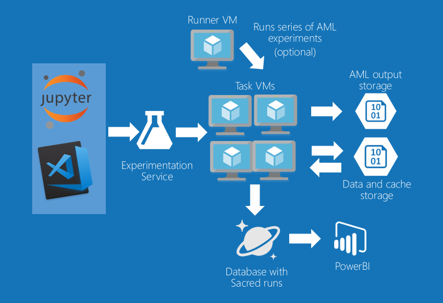

# Text classification to detect toxic comments using Azure ML Services for Kaggle Jigsaw competition

Pipeline author: [Andrey Vykhodtsev](https://www.linkedin.com/in/vykhand/)

[GitHub Pages link](https://vykhand.github.io/kaggle-jigsaw)

## Attribution

My work here is focused on tooling, monitoring, execution, clean pipeline and integration with Azure services. Other code was adopted from many public kernels and github repositories that can be [found here](https://www.kaggle.com/c/jigsaw-toxic-comment-classification-challenge/kernels) and [here](https://www.kaggle.com/c/jigsaw-toxic-comment-classification-challenge/discussion). I tried to keep the references to original kernels or githubs in the code comments, when appropritate. I apologize if I missed some references or quotes, and if so, please let me know.

## About this solution

This is the pipeline I developed during the [Kaggle Jigsaw Toxic comment classification challenge](https://www.kaggle.com/c/jigsaw-toxic-comment-classification-challenge). In this competition, I focused more on tools rather than on winning or developing novel models.

The goal of developing and publishing this is to share reusable code that will help other people run Kaggle competitions on Azure ML Services.

This is the list of features:

 * Everything is a hyperparameter approach. Config files control everything from model parameters to feature generation and cv.
 * Run experiments locally or remotely using Azure ML Workbench
 * Run experiments on GPU-based [Azure DSVM](https://aka.ms/dsvm) machines
 * Easily start and stop VMs
 * Add and remove VMs to and from the VM fleet
 * Zero manual data download for new VMs - files are downloaded from Azure Storage on demand by code.
 * Caching feature transformations in Azure Storage
 * Shutting down the VMs at the end of experiment
 * Time and memory usage logging
 * Keras/Tensorboard integration
 * Usage of [Sacred](https://pypi.python.org/pypi/sacred) library and logging experiment reporducibility data to CosmosDB
 * Integration with Telegram Bot and Telegram notifications
 * Examples of running LightGBM, sklearn models, Keras/Tensorflow


## Presentations and blog posts

This solution is accompanying a few presentations that I gave on [PyData meetup in Ljubljana](https://www.meetup.com/PyData-Slovenia-Meetup/) and [AI meetup in Zagreb](https://www.meetup.com/Artificial-Intelligence-Future-Meetup/). Links to the slides:

 * [PyData Ljubljana #5](https://www.slideshare.net/andreyvykhodtsev/20180328-av-kagglejigsawwithamlwb-92229518)
 * [AI Future Zagreb](https://www.slideshare.net/andreyvykhodtsev/20180405-av-toxiccommentclassification-92986374)

I am also writing a blog post which is going to published [here](https://vykhand.github.io).

## Technical overview of the solution

This sample solution allows you to run text classification experiments via command line or via [Azure ML Workbench](http://aka.ms/AzureMLGettingStarted).
To see, how to run, configure and monitor experiments, refer to the [Standard Operating Procedures]() section.
If you wish to extend or modify the code, please refer to [Modifying the solution]

### Pipeline

Pipeline intends to be extendable and configurable to support "everything is a hyperparameter" approach.


### Architecture
Below is the diagram of compute architecture. I used cheap Windows DSVM (burst instances) to run series of experiments and stop the machines after all experiments are finished.
I used 2-3 CPU VMs and 2 GPU vms to run experiments. I used minimial sized collections for CosmosDB to store "python/sacred" experiment information.
Information from Azure ML runs is stored in a separate storage account, which has 1 folder per experiment, automatically populated by AML.




### Experiment flow

 1. Run az ml command or use AML WB to start an experiment
 1. Azure ML Experimentation services send your code to VSTS/git special branch
 1. Azure ML Experimentation spins off a docker container on the appropriate compute and monitors the progress
 1. The pipeline code takes care of downloading all necessary files, so it can be ran on completely new VM
 1. Python Sacred library saves detailed telemetry to CosmosDB
 1. Python Sacred library notifies you via Telegram when experiment starts and ends, together with experiment results.
 1. When experiment ends, Azure ML saves all the resulting files to your Azure Storage account


TODO: draw better diagram


## Deploying solution

This is not a turnkey solution. You will probably have to fix something or customize the code to your needs. Here is the approximate instruction how to set up the new deployment on your local machine from scratch.

 1. Run ```git clone https://github.com/vykhand/kaggle-jigsaw``` to clone the [git repository](https://github.com/vykhand/kaggle-jigsaw)
 1. [Install AML Workbench (AMLWB)](https://docs.microsoft.com/en-us/azure/machine-learning/preview/quickstart-installation)
 1. Add github folder to AMLWB ()
 1. Log in to [Azure using CLI](#Setting-up-Azure-CLI-and-logging-in)
 1. Use the [Example script](https://github.com/vykhand/kaggle-jigsaw/blob/master/scripts/example_dsvm.azcli) to set up new VM
 1. Create Azure Storage and load data to it
 1. Create Cosmos DB for Sacred experiment monitoring.
 1. (Semi-optional) Create and configure Telegram bot.
 1. To be able to auto-shutdown VMs, get Azure subscription keys to be able to use Python management SDKs.
 1. Configure your runconfig environment variables, copying them from [Example VM configuration](https://github.com/vykhand/kaggle-jigsaw/blob/master/aml_config/example_dsvm.runconfig) to your ```amlconfig\<vm>.runconfig``` file and populate them with your own values.
 1. If you are setting up a GPU VM, be sure to follow the [instruction](https://docs.microsoft.com/en-us/azure/machine-learning/preview/how-to-use-gpu) or copy the the [Example GPU config](https://github.com/vykhand/kaggle-jigsaw/blob/master/aml_config/example_nc6_dsvm.runconfig)
 1. You are now good to go. Refer to [Standard Operating Procedures]() to understand how to run and configure experiments

Below you will find the details on (almost) each step

### Setting up Azure ML Services

In this competition, I used experiment monitoring facility and notebook facility. Azure ML has many other capabilities as described at <http://aka.ms/AzureMLGettingStarted>

### Getting the data and uploading it to storage account

Data for this competition is not distributed with this repository. You need to download it from the competition page located [here](https://www.kaggle.com/c/jigsaw-toxic-comment-classification-challenge/data).
You can use [Kaggle API](https://github.com/Kaggle/kaggle-api) to download data from command line.

There are also multiple other external files that I used for this competition:

 * [Google's Full list of banned words](https://www.freewebheaders.com/full-list-of-bad-words-banned-by-google/)
 * [Glove embedding vectors](https://nlp.stanford.edu/projects/glove/)
 * [FastText embedding vectors](https://github.com/facebookresearch/fastText/blob/master/pretrained-vectors.md)

To be able to run this solution, you need to set up your storage account, upload the required files there and configure the following variables in your ```.runconfig``` file:

```
  "AZURE_STORAGE_ACCOUNT": ""
  "AZURE_STORAGE_KEY": ""
  "AZURE_CONTAINER_NAME": "kaggle-jigsaw"
```


### Setting up Azure CLI and logging in

AZCLI should be set up together with Azure ML Workbench.

To make sure your PATH variable is set up to use the AML WB environment, you should either start cmd.exe or powershell from AMLWB, or open terminal with VS code in your project (if VS Code was set up by AMLWB)

Verify az verison:

```
az --version
```

You need to login with az by typing the command and following the instructions

```
az login
```

then you need to set your subscriptipon using the commands

```
# show subscriptions
az account list
# set subscription
az account set -s <subscription_name>
```


### Setting up Azure Service principal

This is only needed to shutdown the VMs automatically. In order to set it up, you need to configure the following environment variables in your runconfig file:

```
  "AZURE_CLIENT_ID":  ""
  "AZURE_CLIENT_SECRET": ""
  "AZURE_TENANT_ID": ""
  "AZURE_SUBSCRIPTION_ID":
```

[This document](https://docs.microsoft.com/en-us/azure/azure-resource-manager/resource-group-create-service-principal-portal#get-application-id-and-authentication-key) describes how to find this information.

### Setting up Cosmos DB

Create new cosmosDB instance with MongoDB API as default API. You don't need anything else, as Sacred library will take care of creating your collections.

You need to specify your mongodb connection string using this env variable in your ```.runconfig``` file.

```
"COSMOS_URL": "mongodb://<>:<>"
```

this string can be found in the "Connection String" section of your CosmosDB in the Azure Portal.

### Create and configure Telegram bot

This is non-essential but I don't have a config option to switch it off. So if you don't want to use it, you'll have to comment all the lines like this:

```python
**_experiment.observers.append(u.get_telegram_observer())
```

To configure telegram bot, please follow [this instruction](http://sacred.readthedocs.io/en/latest/observers.html#telegram-observer) to set it up, and then update [telegram.json](https://github.com/vykhand/kaggle-jigsaw/blob/master/aml_config/telegram_conf.json) file.

```json
{
    "token": "your telegram token",
    "chat_id": "chat id"
}
```

## Standard operating procedures

### Running experiments from command line

Running GRU model with default config:

```
az ml experiment submit -c dsvm001 run.py GRU
```
Running with configuration file (modified file copied from conf_template)

```
az ml experiment submit -c dsvm001 run.py --conf experiment_conf/GRU.yaml
```

### Running experiments with AMLWB

you can run ```run.py``` script with AML WB on your favourite compute, specifying configuration file or modeltype as an argument


### Accessing experiment files
After you run the experiment, all the files are available in the output Azure Storage. You can easily access these files using Azure ML Workbench:


You can also locate your Azure Storage that is created together with your Azure ML Experimentation account and download files from there:

 or [example_nc6_dsvm.json]()
 1. Copy and modify [example_dsvm.azcli](), replacing the example_dsvm with your VM name
 1. Run the commands in your azcli file

```
az group create -n example_dsvm -l northeurope

# now let's create the DSVM based on the JSON configuration file you created earlier.
# note we assume the mydsvm.json config file is placed in the "docs" sub-folder.
az group deployment create -g example_dsvm --template-uri https://raw.githubusercontent.com/Azure/DataScienceVM/master/Scripts/CreateDSVM/Ubuntu/azuredeploy.json --parameters @scripts/example_dsvm.json

# find the FQDN (fully qualified domain name) of the VM just created.

az vm show -g example_dsvm -n example_dsvm -d

# attach the DSVM compute target
# it is a good idea to use FQDN in case the IP address changes after you deallocate the VM and restart it

az ml computetarget attach remotedocker --name example_dsvm --address example_dsvm.northeurope.cloudapp.azure.com --username <username> --password "<yourpass>"

# prepare the Docker image on the DSVM
az ml experiment prepare -c example_dsvm
```

### Deallocating machines

run

```
az vm deallocate -g <vm_group> -n <vm_name>
```

### Running series of experiments

specify folder name and compute target. the script will run all the experiments and will shut down the VM at the end

```
python run_folder.py experiments_conf\folder_name dsvm001
```

### Monitoring GPU usage

login to your GPU VM and run

```
watch nvidia-smi
```

### Monitoring Tensorflow using Tensorboard

Note the tensorflow logdir link in your experiment log:


You just need the logdir name. Then log into your GPU VM and run:

```
tensorboard --logdir ~/.azureml/share/<your projectpath>/<logdir name>
```

### Retrieving experiment results from CosmosDB

You can use the portal or VS Code plugin to access the data in CosmosDB:


You can also set up the PowerBI dashboards that connect to your CosmosDB.

## Modifying solution

Programmers love developing their own frameworks. There is a chance, that you will hate mine. But in case you'd like it, here are some pointers on modifying and extending it.

### Code structure

## Future work and TODOs
